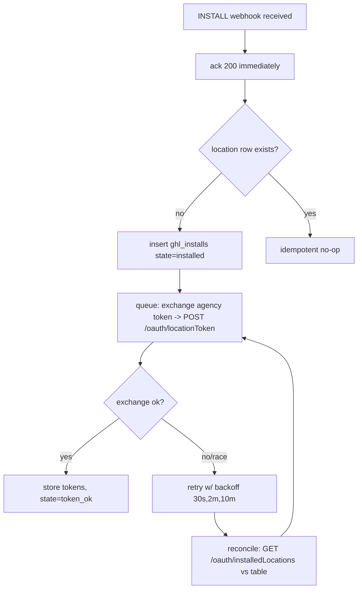
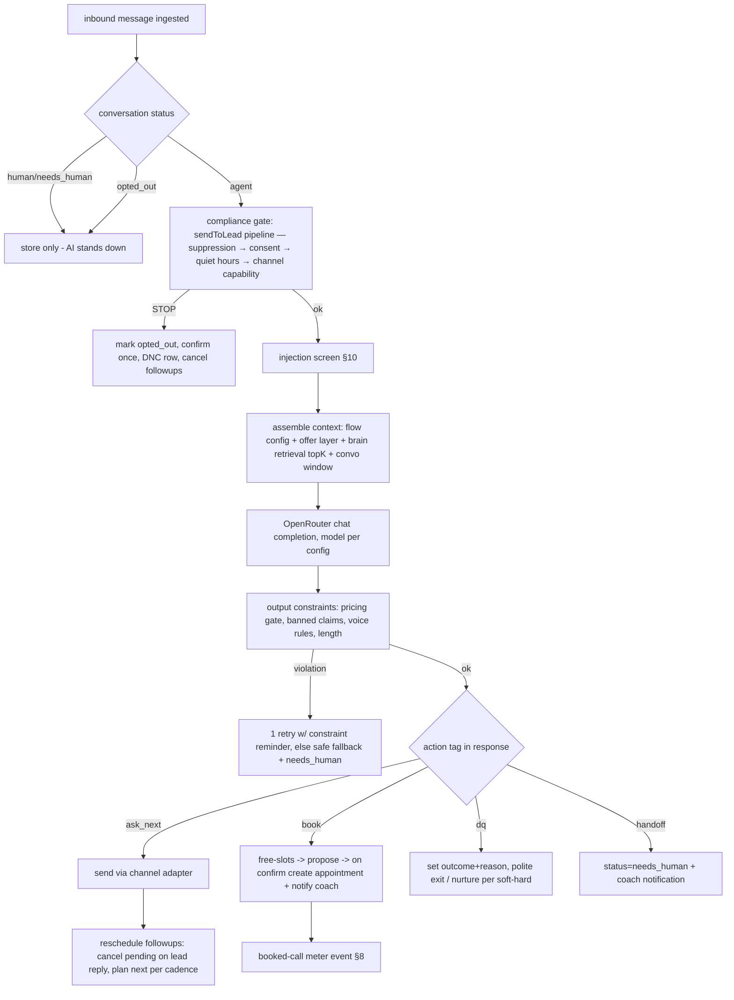
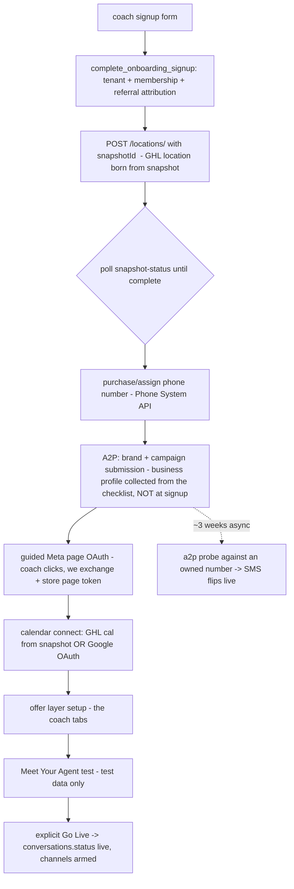

# BACKEND-SPEC — SetterFi backend, implementation grade

Audience: a developer with zero project context. Read docs/ENGINEERING-BRIEF.md first, then this
top to bottom. Every subsystem below specifies schema, routes, contracts, and jobs. Stack:
Next.js route handlers + Vercel (one project, `setter-fi` — no staging environment, see §10.5),
Supabase Postgres + pgvector (new project under
the client's org), OpenRouter (LLM chat completions), OpenAI (embeddings only), Stripe,
GoHighLevel API v2, Meta Graph API. TypeScript, zod on every boundary. Base rule: **ack every webhook <1s, process via `waitUntil()`/queue.**

## 0. Conventions

- IDs: `uuid` (`gen_random_uuid()`), timestamps `timestamptz` default `now()`, soft deletes only
  where specified. Money in integer cents. All tables carry `created_at`, mutable ones `updated_at`.
- **Every tenant-owned table has `tenant_id uuid not null references tenants(id)` and FORCE RLS.**
- `service_role` bypasses RLS → every webhook/job handler re-imposes tenant scoping in code
  (documented Supabase gotcha). Never interpolate tenant from request body.
- **Tenant derivation, stated precisely.** "Derive from the signature" is not achievable on GHL —
  the signature proves the payload came from GHL and nothing more; it carries no tenant. The actual
  rule is: verify the signature against the raw request bytes → read `locationId` out of the body →
  look up `ghl_installs` → **reject an unknown `locationId` outright**. The body stays untrusted for
  every field except that one lookup key, whose only power is to select a row we already own.
- **Count round trips, not milliseconds of SQL.** A trip to the Supabase region costs roughly 350 ms
  against queries that run in single-digit milliseconds, so a screen's latency is set by how many
  times it goes to the database and not by how the statements are written. The measurements and the
  read-path rules they produced are in §9.1.
- Vector search gotcha: RLS post-filtering can return < K rows — query with iterative index
  scans / raised `ef_search`, over-fetch then filter.
- API routes live under `app/api/*`; internal handlers verify auth via Supabase JWT; webhook
  handlers verify provider signatures (GHL, Meta X-Hub-Signature-256, Stripe-Signature). Every one
  of these is computed over the **raw request body** — a re-serialized object will not verify, and
  Next.js route handlers make it easy to consume the body before you've kept the bytes.
- **GHL signature specifics.** There is no per-app secret: verification is against a **platform-wide
  published public key** held in an env var. Prefer `X-GHL-Signature` (Ed25519); fall back to
  `X-WH-Signature` (RSA-SHA256) only when the Ed25519 header is absent. The legacy RSA header is
  **removed 2026-09-01**, so the fallback is a transition affordance with an expiry date, not a
  permanent branch. Because the key is platform-wide and rotates on GHL's schedule (announced by
  email and developer Slack), verification must accept either the old or the new key while both are
  configured — see the rotation procedure in `ARCHITECTURE.md` Operations.
- **Meta signature note:** `X-Hub-Signature-256` is correct as specified. The raw-body requirement
  above is our engineering constraint rather than something Meta documents, so it needs a test.

## 1. Multi-tenant auth + roles + RLS

Supabase Auth (email/password + email OTP). One Supabase project, one schema.

```sql
create type user_role as enum ('owner','admin','success','build','coach','coach_member','affiliate');
create type tenant_status as enum ('onboarding','active','paused','overdue','suspended','churned');

create table tenants (            -- one row per coach business (sub-account)
  id uuid primary key default gen_random_uuid(),
  slug text unique not null,
  name text not null,
  status tenant_status not null default 'onboarding',
  ghl_location_id text unique,            -- set on provisioning
  success_owner uuid references users(id),
  tier_id uuid references tiers(id),
  created_at timestamptz not null default now(),
  updated_at timestamptz not null default now()
);
create table users (
  id uuid primary key,                     -- = auth.users.id
  email text unique not null,
  full_name text,
  role user_role not null,
  tenant_id uuid references tenants(id),   -- null for platform roles (owner/admin/success/build)
  created_at timestamptz not null default now()
);
create table audit_log (                   -- every privileged action ("Logged" chips become real)
  id bigint generated always as identity primary key,
  actor_id uuid references users(id),
  tenant_id uuid,
  action text not null,                    -- e.g. 'brain.published','conversation.takeover','meter.adjust'
  target text, reason text, payload jsonb,
  created_at timestamptz not null default now()
);
```

RLS pattern (applied to every tenant table; example on `contacts`):

```sql
alter table contacts enable row level security;
alter table contacts force row level security;
create policy tenant_isolation on contacts
  using (tenant_id = (select tenant_id from users where id = auth.uid()));
create policy platform_read on contacts for select
  using (exists (select 1 from users u where u.id = auth.uid()
                 and u.role in ('owner','admin','success')));
```

Role capabilities (enforce in policies + route guards): owner=everything; admin=everything minus
payout settings; success=clients/conversations/provisioning, NO brain publish, NO billing edit;
build=dev seats, revoked at handover; coach=own tenant only; coach_member=own tenant, no billing;
affiliate=own referral rows only (name/status/commission — never performance data).
"View as" (admin impersonation) = short-lived JWT claim `impersonating_tenant`, always audit-logged.

## 2. GHL integration layer

Marketplace app: **Private**, distribution Agency, installed once by the client's agency with
"all current + future sub-accounts". Base `https://services.leadconnectorhq.com`. API v2 only.

**`Version` is a required header on every call and it is not one value.** It is pinned per API
family, not per app, and sending the wrong one fails the call rather than degrading it:

| API family | `Version` |
|---|---|
| OAuth (`/oauth/token`, `/oauth/locationToken`, `/oauth/installedLocations`) | `2021-07-28` |
| Locations, Companies, Users, Snapshots | `2021-07-28` |
| Conversations, Messages | `2021-04-15` |
| Contacts, Opportunities, Calendars | `2021-07-28` |
| Phone System / number pools | `2021-07-28` |

**`POST /locations/` requires the agency to be on the Agency Pro ($497) plan.** Sub-account creation
is the first step of provisioning, so a downgrade silently breaks onboarding at step one. The tier is
machine-readable — read `companyPlan` off the company record and gate the provisioning flow on it
rather than discovering it from a 4xx in production.

**Rate limits are per app per *resource*, where a resource is a Location or the Company** — not
"per location" as previously written. That distinction matters because the four company-scoped
provisioning calls (`POST /locations/`, `POST /users/`, snapshot push, snapshot status) all share a
single Company bucket across every tenant, so a burst of signups contends with itself in a way
per-location math does not predict. Limits are 100 req/10s and 200k/day per bucket; drive backoff
from the `X-RateLimit-*` response headers rather than from a local counter.

```sql
create table ghl_installs (
  id uuid primary key default gen_random_uuid(),
  tenant_id uuid references tenants(id),        -- null until matched to a tenant
  location_id text unique not null,
  company_id text not null,
  access_token text not null,                   -- encrypted at rest (pgsodium)
  refresh_token text,                           -- NULLABLE: present per the v3 spec and the live
                                                -- docs sample, absent from the v2 schema — branch
                                                -- on presence, never assume it (corrected 2026-08-15)
  token_expires_at timestamptz not null,
  install_state text not null default 'installed', -- installed|token_ok|failed|uninstalled
  created_at timestamptz not null default now(),
  updated_at timestamptz not null default now()
);

-- Company (agency) credentials are a different shape from location credentials and do not belong
-- in the table above: there is one row per agency install, and the token exchange returns install
-- scope fields that have no location analogue.
create table ghl_company_installs (
  id uuid primary key default gen_random_uuid(),
  company_id text unique not null,
  access_token text not null,                    -- encrypted (pgsodium)
  refresh_token text not null,                   -- always present, ROTATES ON EVERY USE
  token_expires_at timestamptz not null,         -- expires_in: 86399
  approved_locations text[],                     -- the authorization boundary, from the exchange
  install_to_future_locations boolean,
  approve_all_locations boolean,
  is_bulk_installation boolean,
  created_at timestamptz not null default now(),
  updated_at timestamptz not null default now()
);

-- Replay protection. GHL redelivers, and an at-least-once webhook that appends messages will
-- duplicate a lead's conversation without this.
create table ghl_webhook_seen (
  webhook_id text primary key,
  received_at timestamptz not null default now()
);
```

**Token lifecycle + INSTALL race (GitHub issue #294 — handle defensively):**



Four things about that flow that the diagram cannot carry:

- **An agency-level INSTALL has no `locationId` at all**, so a handler that reads one and branches
  will throw on the most important install event we receive.
- **A future-location INSTALL may omit `companyId` and `userId`.** `companyId` therefore has to come
  from our stored company record, not from the payload — which is another reason the company install
  is its own table rather than a nullable column set.
- **INSTALL and UNINSTALL arrive on the default webhook URL only**, not on any per-event URL we
  configure. Register that one endpoint and route by `type` inside it.
- **`GET /oauth/installedLocations` is the primary correctness mechanism, not a nightly fallback.**
  Given a race that GHL has an open issue on (#294) and events that can arrive without the fields we
  key on, reconciliation is the thing that is actually true; the webhook is a latency optimization
  on top of it. Run it on a short cycle, and treat a location present in the API but missing from
  our table as an install we dropped rather than as noise.

**Company (agency) token:** 24h life (`expires_in: 86399`), and the refresh token **rotates on every
use** — the old one dies the moment the new one is issued. That makes refresh the single most
fragile operation in the integration: a rotation that succeeds at GHL but fails to persist on our
side leaves us holding a dead token with no way back, and recovery is a **manual re-install by the
client's agency**. So the refresh must be persisted transactionally with the exchange and taken
under a **single-flight lock** — two concurrent refreshes race each other into exactly that state.
Cron every 12h against a 24h life gives one free retry before expiry.

**Location token:** also 24h. The refresh token is documented in the v3 spec and appears in the live
docs sample but is **absent from the v2 schema**, so treat it as optional and branch on presence
(corrected 2026-08-15 — an earlier pass recorded it as absent outright). The reason this is
survivable is that location tokens are re-mintable from the agency token at any time:
`POST /oauth/locationToken`, form-urlencoded `companyId` + `locationId`, agency bearer token,
`Version: 2021-07-28`, scope `oauth.write`.

All GHL calls go through one client module `lib/ghl/client.ts` that: picks the location token by
tenant, auto-refreshes on 401 (re-minting rather than refreshing, for location tokens), sets the
right `Version` per API family, and logs to `integration_events`. Rate limiting is **two bucket
namespaces**, one keyed on `locationId` and one on `companyId`, both driven by the `X-RateLimit-*`
response headers — a single per-location bucket does not model the shared Company bucket at all.

**Webhook: InboundMessage** (signed per §0) → `POST /api/webhooks/ghl`
Payload (normalize): `{type:"InboundMessage", locationId, contactId, conversationId, messageType
(SMS|FB|IG|GMB|Live_Chat|WhatsApp|Email|Call), body, attachments[], dateAdded}`.
Handler: verify signature → ack → `waitUntil`: resolve tenant by locationId → upsert contact →
append `messages` row (direction=in, provider=ghl) → enqueue `agent.turn` (§3). Idempotency key:
provider message id, plus the `webhook_id` dedupe table above.

- **`messageType` has no published enum**, so the list above is observed rather than exhaustive.
  Unknown values **log and skip**; they must not throw, because a throw here is indistinguishable
  from an outage as far as GHL's delivery-rate circuit breaker is concerned.
- **`GMB`** (Google Business Profile messaging) is a real value and was missing from our set.
- **Voicemail is a `CALL` in disguise:** `messageType: "CALL"` with `status: "voicemail"` and the
  recording in `attachments[]`. It needs its own branch — feeding a voicemail recording into the
  text pipeline as a message body produces nonsense.
- **Return 2xx before any fallible work, without exception.** GHL disables webhook delivery for the
  whole app when the success rate drops below 90% over three days, and re-enabling is manual. A
  handler that does a database write before acking converts a transient Supabase blip into a
  platform-wide messaging outage that needs a human in the marketplace console to clear.

**Send:** `POST /conversations/messages` with `{type, contactId, message, conversationId?}` —
types SMS/WhatsApp/IG/FB/Live_Chat. Threading + scheduling supported.
**Calendars:** `GET /calendars/{id}/free-slots?startDate&endDate` (range ≤31 days) →
`POST /calendars/events/appointments` `{calendarId, locationId, contactId, startTime, endTime}`.
**Users:** `POST /users/` → coach's GHL login on the client's white-label domain. Required body is
`{companyId, firstName, lastName, email, password, type, role, locationIds[]}` — our previous
`{locationIds:[loc], email, password, ...}` was missing five required fields, including `companyId`,
which is what makes this a Company-bucket call rather than a Location one. "Email is unique
platform-wide" is an **unverified assumption**, not a documented fact; the suffix-collision strategy
stays, but confirm the constraint in sandbox before relying on the error to detect duplicates.
**Custom values:** per-location config injection (agent name, program name) written at provision.
**Pipelines: READ-ONLY via API — ship inside the snapshot.** Stage moves via opportunities API.

**Snapshot polling.** The path is `GET /snapshots/snapshot-status/{snapshotId}/location/{locationId}`
and it is incomplete as previously written: it requires **`?companyId=`** and the **agency** token,
not the location token. The response carries `completed[]` and `pending[]` arrays, and **completion
is `pending` being empty** — there is no status string to compare against, because no status enum is
published. More importantly, **no failure status is documented at all**, so a snapshot push that
dies looks exactly like one that is still running. The poll therefore needs a hard timeout and an
escalation path into the provisioning tracker; without one, a stuck signup waits forever in amber.

**Sandbox validation list (sprint-1, before onboarding module is committed):**
1) ~~bulk-install covers future sub-accounts~~ — **now answerable from the company-token exchange
response** (`installToFutureLocations`, `approveAllLocations`, `isBulkInstallation`) rather than by
observation; confirm the values are what we expect rather than whether the feature exists.
2) INSTALL race behavior observed and the reconcile loop proves out.
3) WhatsApp inbound on the InboundMessage webhook — **resolved to a default, keep this as
confirmation of a bonus rather than a dependency**: WhatsApp inbound is not a documented
`InboundMessage` channel and rides the Meta app path; outbound WhatsApp via
`POST /conversations/messages` is supported.
4) Snapshot-load timing p50/p95, plus the two unknowns above: what a completed push looks like on
the wire and what a failed one looks like.
5) Phone System scopes — the strings are `phonenumbers.read`, `phonenumbers.write`, and
`numberpools.read`, but they are **absent from GHL's published scope table**, so the actual test is
whether they are selectable in the app's scope dropdown at all. Scopes are set at app-creation time
and expensive to change, so this needs answering before the app is finalized, not after.
6) **Confirm the agency is on Agency Pro** — `POST /locations/` is gated on it and provisioning
cannot work without it.
Record findings in this file under "SANDBOX FINDINGS" when done.

## 3. Conversation engine

The heart. One entry point: `agent.turn(tenant_id, conversation_id, inbound_message)`.

```sql
create type convo_status as enum ('agent','needs_human','human','nurture','closed','opted_out');
create type outcome as enum ('BOOK','SOFT_DQ','HARD_DQ');

create table contacts (
  id uuid primary key default gen_random_uuid(),
  tenant_id uuid not null references tenants(id),
  ghl_contact_id text, channel text not null,      -- instagram|messenger|sms|whatsapp|webchat
  name text, phone text, email text,
  credit_range text, funding_goal text, timeline text, business_context text,
  outcome outcome, dq_reason text,
  opted_out boolean not null default false,
  opt_in_source text,                              -- required before campaign-initiated outreach
  timezone text,                                   -- IANA; for quiet hours
  is_test boolean not null default false,          -- test data segregation
  last_seen_at timestamptz,
  created_at timestamptz not null default now(), updated_at timestamptz not null default now(),
  unique (tenant_id, ghl_contact_id)
);
create table conversations (
  id uuid primary key default gen_random_uuid(),
  tenant_id uuid not null references tenants(id),
  contact_id uuid not null references contacts(id),
  channel text not null, status convo_status not null default 'agent',
  taken_over_by uuid references users(id), taken_over_at timestamptz,
  current_step text,                               -- question id in the coach's flow
  is_test boolean not null default false,
  unread_by_coach boolean not null default true,   -- R-item read/unread
  created_at timestamptz not null default now(), updated_at timestamptz not null default now()
);
create table messages (
  id uuid primary key default gen_random_uuid(),
  tenant_id uuid not null, conversation_id uuid not null references conversations(id),
  direction text not null,                          -- in|out|system
  author text not null,                             -- agent|lead|human:<user_id>|system
  body text not null, provider text, provider_message_id text unique,
  trace jsonb,                                      -- grounding receipt: rule fired, passages, model, latency, cost
  created_at timestamptz not null default now()
);
create table followups (
  id uuid primary key default gen_random_uuid(),
  tenant_id uuid not null, conversation_id uuid not null references conversations(id),
  touch_no int not null, purpose text not null,     -- lead_magnet|training|value_nudge|proof_point|new_angle|last_touch
  scheduled_at timestamptz not null,
  status text not null default 'scheduled',         -- scheduled|sent|canceled
  created_at timestamptz not null default now()
);
```

**Turn sequence:**



- **Model routing:** `model_configs` table (id, label, openrouter_model, params, is_default,
  last_benchmark_run_id). Engine reads tenant→config or default. Streaming to UI via SSE for the
  test panel; production channel sends are non-streaming.
- **Qualification flow config:** per-tenant ordered question list (the coach's toggles/order from
  the UI) stored as `flow_configs (tenant_id, questions jsonb, version, published_at)` — mirrors
  the qualification decision table (platform) + coach thresholds (offer layer). Decision =
  platform decision table (first-matching-row wins) evaluated over captured enums; coach settings
  only bound thresholds/enable/order — cannot override outcomes.
- **DQ reason capture** is mandatory on any DQ path (enum + free text from model, stored on contact).
- **Objection handling:** matcher over `brain_objections` (pattern/keywords → grounded response,
  per round-2: keyword chips). Unmatched objections land in `unmatched_objections` queue (R13).
- **Follow-up scheduler:** cron sends due `followups` through `sendToLead` — HARD GATES:
  skip+reschedule if quiet hours (one deferral, then stale → discarded, never a second reschedule);
  cancel all pending on lead reply (`cancel-on-reply`); never for opted_out; business-initiated
  WhatsApp outside the 24h window requires an approved template (§4). Touch lists are
  capability-shaped per connected channel (Phase 3): **durable** channels (SMS, Meta DM) get the
  five fixed timings; **window-bound** channels (WhatsApp) get at most two inside-window timings;
  `none` promises no send. The cadence page renders the resolved capability, never the stored
  advisory class.
- **HUMAN TAKEOVER:** `POST /api/conversations/:id/takeover` → status=human, `taken_over_by`,
  system message inserted, ALL scheduled followups canceled, agent hard-stops (checked at turn
  entry — the AI "stands down cleanly" per §2.8). `.../handback` restores agent with context.
- **Booking notifications** (§2.8): on appointment create → notify coach via GHL (SMS/email per
  coach notification rules) + in-app bell + optional email alert (§ alerts).

## 4. Dual channel architecture

Adapter interface (one per provider path): `send(tenant, contact, body, opts)`,
`normalizeInbound(payload) -> InboundMessage`, `capabilities()`.

> **Superseded (Phase 4, 2026-08-17):** the connection/template shapes below predate the build.
> The implemented contracts are `supabase/migrations/20260820000001_phase4_channels.sql` (schema),
> `src/lib/integrations/types.ts` (Contract A: `MessagingDriver`, `MessagingCapabilities`,
> `NormalizedInboundBatch`) and `src/lib/repositories/channel-connections.ts` /
> `message-templates.ts` (Contract B). Read those, not this sketch.

```sql
create table channel_connections (
  id uuid primary key default gen_random_uuid(),
  tenant_id uuid not null references tenants(id),
  channel text not null,             -- instagram|messenger|sms|whatsapp|calendar_google|calendar_ghl
  provider text not null,            -- meta_direct|ghl
  state text not null default 'disconnected',
  -- state machine: disconnected -> connecting -> pending_review (a2p/wa-verify) -> ready -> live
  --                -> flagged | restricted | blocked_permanent | error | expired
  -- flagged/restricted are WhatsApp's degraded-but-still-sending states: neither is `error` (the
  -- channel works) and neither is `live` in the sense the happy path means. blocked_permanent is
  -- the A2P terminal-rejection state — credit-repair/loan-marketing/debt-reduction rejections are
  -- NOT resubmittable, so there has to be a state that never returns to pending_review.
  quality_rating text,               -- WhatsApp: green|yellow|red — drives the flagged transition
  messaging_tier text,               -- WhatsApp: 250|1k|10k|100k|unlimited, admin System page
  external_ref jsonb,                -- page_id | ig_user_id | phone_number_id | waba_id |
                                     -- calendar_id, PLUS the Graph host in use
                                     -- (graph.facebook.com vs graph.instagram.com) and, for
                                     -- Instagram, which login generation the connection came from
  access_token text, token_expires_at timestamptz,   -- encrypted; page/waba-scoped tokens
  last_heartbeat_at timestamptz, error text,
  unique (tenant_id, channel)
);
```

**The `unique (tenant_id, channel)` constraint means one connection per channel per tenant.** That is
correct for the current design (SMS always rides GHL) and it is the line that would have to change
first if a coach were ever allowed to bring their own SMS provider alongside — recorded here because
it is a schema decision masquerading as a constraint.

- **Meta direct (primary):** coach connects own FB page / IG via OAuth (SetterFi Connector app,
  FB Login for Business); inbound via Meta webhooks (`/api/webhooks/meta`, X-Hub-Signature-256,
  page→tenant lookup). WhatsApp: per-coach number via Embedded Signup (Tech Provider — requires
  App Review/Advanced Access before third-party coaches; the client's own WABA works now), capped
  at **10 onboardings per rolling 7 days** until we clear Access Verification.

- **There is no single outbound send path — there are three, on two hosts.** `me/messages` with a
  page token covers only Messenger, and the adapter has to carry all of:
  - **Messenger:** `POST graph.facebook.com/{PAGE_ID}/messages`, Page token, `pages_messaging`.
  - **Instagram, Instagram-Login generation:** `POST graph.instagram.com/{IG_ID}/messages`, IG user
    token, `instagram_business_basic` + `instagram_business_manage_messages`. No Facebook Page
    required — this is the path for coaches who only have Instagram.
  - **Instagram, Facebook-Login generation:** `POST graph.facebook.com/...`, Page token,
    `instagram_basic` + `instagram_manage_messages` + `pages_manage_metadata`. Requires a linked
    Facebook Page **and** a manual toggle the coach flips on their phone (Instagram app →
    Settings → Connected Tools → allow access to messages). No API can set it, so onboarding has to
    instruct it and then verify by observation.
  - **WhatsApp:** `POST graph.facebook.com/{PHONE_NUMBER_ID}/messages`.
  `messaging_type` is a **required** send parameter on Messenger and Instagram.

- **The 24-hour window is 24 hours everywhere, and everything else about it differs per provider.**
  - *What opens and resets it:* WhatsApp — any inbound message or call, sliding reset. Messenger —
    six triggers including reactions and postbacks. Instagram — an inbound message, and only that.
  - *What may follow expiry:* WhatsApp — an approved template (store template ids per tenant; this
    belongs to WhatsApp only, not to the shared rule). Messenger — message tags, sponsored messages,
    or one-time notification. Instagram — `HUMAN_AGENT` only, **which means nothing at all for an
    automated sender.**
  - WhatsApp additionally has a **72-hour free entry-point window** on click-to-WhatsApp arrivals,
    and a Meta-level opt-in requirement that is separate from and stricter than TCPA.
  - Consequence for the engine: **any follow-up more than 24h after a lead's last message is
    SMS-only, WhatsApp-template-only, or human-gated.** The adapter exposes this as
    `capabilities().post_window: 'template' | 'human_agent_only' | 'none'` so the cadence engine
    reads a capability instead of hardcoding a channel list.
- **`HUMAN_AGENT` tag: humans only, never the AI** (Meta policy — suspension risk, and the
  suspension lands on the *coach's* Page or IG account, not ours). Beyond the policy: `human_agent`
  is an **App Review feature gated behind Business Verification which we have not requested**, so
  the tag is unavailable to us today regardless of who is typing. Until that changes, human takeover
  on Meta channels is capped at 24h too.
- **Conversations table:** `human_agent_window_expires_at` (nullable, Meta channels only) is a
  separate column from `provider_window_expires_at` — they are different durations with different
  reset triggers, and overloading one column loses the distinction exactly when it matters.
- **GHL provider path (fallback + SMS backbone):** per §2. SMS ALWAYS rides GHL numbers + A2P.
  Meta-via-GHL used when a coach declines direct OAuth or during Meta review gaps.
- Per-tenant choice recorded on `channel_connections.provider`; engine is provider-blind.
- Heartbeats: cron pings each live connection (Meta token debug, GHL location token check, A2P
  readiness probe per below) → admin System page reads this table. Log
  `X-Business-Use-Case-Usage` on every Graph call so rate-limit headroom is observable rather than
  inferred after the fact.

**The A2P readiness probe, and why "attempt-send classification" was wrong.** GHL exposes no A2P
registration status anywhere — not on an endpoint, not on a webhook, not on the phone-number
record. Verified across the full published surface: 82 specs, 1,203 operations, 58 webhook events.
So the only signal available is whether a send works. The problem is that **a failed send is not
attributable**: `POST /conversations/messages` returns a bare status word with no error code, and
its `ErrorDto` exists only on the opposite direction, where an external provider reports a failure
*into* GHL. "A2P campaign not approved" is therefore indistinguishable from a landline, a
disconnected number, a carrier-level block, or a transient drop.

Which makes the probe design load-bearing:

- Probe by sending to **a number we own and have verified**, on a schedule, per tenant. Because we
  control the destination, every non-A2P explanation for a failure is eliminated by construction,
  and a failure becomes attributable to registration.
- **Never classify readiness from live lead traffic.** A real lead's number can fail for half a
  dozen reasons that have nothing to do with A2P, and misreading one as "not registered" flips a
  working tenant into pending.
- **Never infer readiness from `capabilities.sms` on the phone-number record.** That field describes
  what the number can technically do, and it reads `true` on a number whose campaign has not been
  approved — it is a capability flag, not a registration state.
- **Flag a stalled registration at ~21 days, not 10.** The real sequence is brand → brand vetting →
  campaign submission → carrier vetting, and carrier review alone runs two to three weeks; a 10-day
  alert fires on healthy registrations and trains everyone to ignore it.
- **Terminal rejection gets its own immediate path** to `blocked_permanent`, bypassing the timer
  entirely — there is nothing to wait for.

## 5. Central brain (Supabase pgvector + Notion sync)

```sql
create extension if not exists vector;
create table brain_documents (   -- platform scope (admin-owned, no tenant_id)
  id uuid primary key default gen_random_uuid(),
  source text not null,           -- notion|manual
  notion_page_id text unique, title text not null, section text not null,
  -- section: qualification|objections|voice|compliance|knowledge|faq
  status text not null default 'draft',  -- draft|published
  version int not null default 1, body_md text not null,
  updated_at timestamptz not null default now()
);
create table brain_chunks (
  id uuid primary key default gen_random_uuid(),
  document_id uuid not null references brain_documents(id) on delete cascade,
  chunk_no int not null, content text not null,
  embedding vector(1536),
  published boolean not null default false
);
create index on brain_chunks using hnsw (embedding vector_cosine_ops);
create table brain_knowledge_entries ( -- structured admin-owned Q&A
  id uuid primary key default gen_random_uuid(),
  question text not null, answer text not null,
  category text not null, match_keywords text[] not null default '{}',
  status text not null default 'draft', -- draft|published
  version int not null default 1, updated_at timestamptz not null default now()
);
create table brain_knowledge_usage_events ( -- derived volume; never typed into the entry
  id uuid primary key default gen_random_uuid(),
  knowledge_entry_id uuid not null references brain_knowledge_entries(id) on delete cascade,
  conversation_id uuid not null, tenant_id uuid not null references tenants(id),
  used_at timestamptz not null default now(), is_test boolean not null default false
);
create table offer_layers (      -- per-tenant, bounded self-editing
  tenant_id uuid primary key references tenants(id),
  program_name text, credit_min int, credit_min_enforced boolean,
  funding_goal_min_cents bigint, business_revenue_required boolean,
  credit_repair text,            -- yes_included|yes_extra_fee|no_refer_out|no_good_credit_only
  products text[] , pricing_gate boolean not null default true,
  booking_horizon_days int default 21, booking_mode text default 'direct', -- direct|link
  brand_voice text check (brand_voice in ('friendly', 'neutral', 'professional')),
  voice_answers jsonb, faq jsonb, proof jsonb, assets jsonb, -- lead magnets
  cadence jsonb,                 -- touches w/ purpose enums
  version int not null default 1, published_at timestamptz
);
```

- **Notion sync pipeline** — source is the client's **"Legacy Strong"** workspace, and the
  SetterFi-relevant part of it is a single 46-row database (`Prospect FAQ Sheet / FAQs`:
  `Category` / `Inbound Message` / `Response`). Verified by full extraction 2026-08-13/14; see
  `docs/NOTION-MAP.md`. *(Retracted: this previously named an "Appointwise Setup - CCA Clients"
  workspace with A-docs/B-docs layers. It does not exist.)*
  **The heading-aware prose pipeline below is specced against the wrong shape.** 46 typed rows
  want row-level entries with a `category` facet and embeddings over `Inbound Message` only —
  chunking a 43-word row on headings it does not have produces one chunk per row with worse
  metadata. Respec is Phase 2 work; the flow as written stands only as the fallback for genuinely
  prose sources. Cadence (nightly cron vs manual "Sync now" vs one-time import with the Brain as
  authority) is open and owned by Alec.
  As specced: Notion API delta fetch → markdown → chunk (~500 tokens, heading-aware) → embed
  (OpenAI `text-embedding-3-small`, called directly — OpenRouter has no embeddings endpoint) →
  upsert as DRAFT. Admin reviews diff → **publish** flips `published` atomically per document
  (transaction), bumps version, writes audit row. Retrieval
  reads `published=true` only. Draft context available exclusively in evals/test panel.
- Retrieval: topK=6 cosine over published chunks, filtered by section relevance to the current
  step; over-fetch 2K then trim (RLS/quality gotcha). Every turn's trace stores chunk ids →
  grounding receipt in UI is real.
  **As built in Phase 2:** similarity ranking runs on every turn regardless of corpus size —
  embeddings are computed over the inbound-message text only, category agreement is a bounded
  `0.05` boost rather than a filter, and only published-snapshot entries are candidates. When the
  knowledge section is inline-sized the whole published set may still be assembled into the
  prompt, but the ranked candidates and the chosen entry are recorded in the trace either way,
  so the grounding receipt is real at any size (`docs/BRAIN-COMPILER.md` §2 describes the
  inline/retrieval mode switch at 12,000 tokens).
- Offer-layer bounds enforced server-side with zod: coach cannot alter platform decision-table
  outcomes; numeric bounds sane-capped; pricing text allowed ONLY if pricing_gate=false.

## 6. Self-serve onboarding pipeline

```sql
-- SUPERSEDED by T6-1 and T6-3. The serial chain below is wrong in two ways: a scalar `step`
-- can only report one position while the normal state of a real signup is several things at
-- once, and the order serialises a two-minute Meta OAuth behind a three-week carrier review.
-- What ships instead: a ROW PER STEP —
--   provisioning_steps (id, tenant_id, step_key, state, awaiting_party, attempts,
--     last_attempt_at, started_at, completed_at, error_code, error_message, blocked_reason,
--     external_ref jsonb, unique (tenant_id, step_key))
-- with seventeen steps in five lanes, lanes C and D running concurrently with A and B from
-- the moment the account exists (T6-3). `onboarding_runs` survives as the RUN HEADER only —
-- started_at, readiness_met_at, went_live_at, stalled_flagged_at — and LOSES `step`,
-- `a2p_state` and `error`. The `onboarding_step` and `a2p_state` enums are DROPPED, not left
-- unused. ONB-02 requires every step individually retryable with every failure visible and
-- ONB-04 requires an admin to see which step a signup is stuck on; a scalar holds one position.
create table onboarding_runs (
  id uuid primary key default gen_random_uuid(),
  tenant_id uuid not null references tenants(id),
  step text not null default 'signup',
  -- signup -> ghl_location -> snapshot_wait -> number_provision -> a2p_submitted ->
  --   meta_connect -> calendar_connect -> offer_setup -> test_pass -> live
  a2p_state text default 'not_started', -- not_started|brand_submitted|campaign_submitted|approved|rejected|blocked_10d
  error text, updated_at timestamptz not null default now()
);
```

**Superseded by Phase 5 as built (2026-08-18).** The diagram below is kept for the shape of the
lane, but two things in it are wrong now. Signup does NOT create a Stripe customer or subscription:
`complete_onboarding_signup(...)` births the tenant, membership and referral attribution in one
transaction, and the `billing` step rests at `awaiting_platform` / `subscription_contract_unavailable`
until Phase 6's subscription-readiness port answers — a coach reaches Go live without a card. And the
lane is not serial: `provisioning_steps` holds seventeen independently claimable, independently
retryable step rows, each with its own state and awaiting-party, so the runner advances whatever is
runnable rather than walking one arrow at a time.



- **EIN and the rest of `business_profile` are not collected at signup** (T6-4). The whole SMS
  lane lives in the persistent get-started checklist, never in the wizard's critical path: the
  coach reaches Go live having never touched it, goes live on Meta channels, and opens "Text
  messages" when they want SMS. Asking a stranger for their EIN and registered address before they
  have seen the agent work is a conversion cost with no compliance benefit, since the campaign
  cannot be filed before the number exists and the number takes minutes. Inside the wizard, a
  three-week step reads as "you are stuck at step 2 of 5" no matter what colour it is.
- Meta/IG live immediately on connect; SMS shows amber "registering" until A2P clears (detected by
  probing a number **we own and have verified**, since there is no status API and a failed send to
  a lead is not attributable — see §4); **>21 days** stuck → flag human review; terminal rejection
  → `blocked_permanent`, no timer.
- Provisioning tracker (admin): reads the `provisioning_tracker_rows` projection (service-role only,
  and `listProvisioningTrackerRows(expectedRole)` refuses a non-platform role before it queries).
  Retry is not a generic re-enqueue: it calls the per-step audited RPC `retry_provisioning_step(...)`,
  which is idempotent and **refuses a terminally blocked step**. A terminal 10DLC rejection stays
  `blocked_permanent` with no retry affordance and no timer — the only way out is a new filing, which
  is a human decision, not a button. `unblock_provisioning_step(...)` is the separate, audited
  operator path for the non-terminal blocks.
- A2P sample messages MUST match actual agent output — generate from the tenant's flow config,
  not boilerplate (top rejection reason). Cash-campaign samples: still owed by client.

## 7. TCPA enforced features (engine-level, not prompts)

- **Opt-in gating:** `contacts.opt_in_source` required non-null before any campaign-initiated
  (agent-first-touch) outbound. Inbound-initiated conversations are exempt (lead texted first).
  Enforced in the send path — the adapter refuses, not the prompt.
- **STOP handling — two tiers, and the keyword list is the floor rather than the gate** (T4-6).
  The original single set (STOP/UNSUBSCRIBE/QUIT/CANCEL/END/REVOKE + Spanish ALTO/PARAR) was
  written before the FCC's per se list took effect on **2025-04-11**, and a list alone cannot
  satisfy a rule that says a consumer may revoke "in any reasonable manner."
  **Tier 1 — exact match on a normalised copy** (NFKC, lowercase, strip punctuation and emoji,
  collapse whitespace): the FCC's seven per se words — stop, quit, end, revoke, opt out, cancel,
  unsubscribe — plus `stopall`, `optout`, `unsub`, `remove`, and Spanish `alto`, `parar`, `basta`,
  `cancelar`. Matched when the normalised message **is** one of them, alone or with a trivial
  trailing courtesy word. Case-insensitive, because CTIA Messaging Principles §5.1.3 requires that
  de minimis variance in capitalisation or punctuation not defeat an opt-out.
  **Tier 2 — intent classification** for everything else, from a curated deterministic phrase set
  ("don't text me", "take me off your list", "leave me alone", "stop contacting me"), because the
  FCC requires honouring any reasonable expression of revocation. The phrase set grows from
  production data.
  **Never substring-match a keyword inside a longer sentence:** "stop by my office at 3" and "I
  want to end my contract" are not revocations, and a false opt-out kills a real lead with no
  signal to anyone. CTIA carves out the same case in terms.
  Matched BEFORE the agent sees the message → opted_out=true, one confirmation message,
  suppression row, cancel all followups. Admin DNC list exportable. **Scope is per tenant by
  default; platform-wide rows (`tenant_id is null`) are admin-only** and never written by a lead's
  STOP, since each coach registers their own brand and sends from their own number and is
  therefore a distinct sender (T4-3).
- **Quiet hours: 8:00am–8:00pm lead-local**, seven days a week, on every channel, regardless of
  consent basis (T4-12). 8pm rather than the federal 9pm because Florida and Oklahoma effectively
  cut at 8pm and several other states do too, and a flat 8pm costs an hour we do not need.
  Timezone chain: `contacts.timezone` → **NPA inference** from a static NANP table for
  phone-bearing identities → **11:00am–8:00pm Eastern**, the intersection of 8am–8pm across the
  continental US. **The fallback is never the tenant's timezone** — that is the *sender's*
  location, which is precisely what 47 CFR 64.1200(c)(1) says not to use; a Miami coach messaging
  a Seattle lead at 8:05am Eastern sends a 5:05am text. `contacts.timezone_source` records which
  step produced the value. Outbound outside the window queues to next window open. Applies to
  agent sends AND followups; human sends warn. The window is **admin-writable and narrow-able
  only**, with the range in DDL check constraints (`start >= '08:00'`, `end <= '20:00'`,
  `start < end`) — never a coach, never a success user, and not disableable by any surface
  including a direct PostgREST write (T4-13). The coach sees it read-only, with the reason.
- All three are platform law: rendered as locked cards in admin (existing UI), not tenant-
  disableable.
- **Audit scope is narrower than "every enforcement action"** (T4-16). The registry carries the
  actions that have an **actor**: `consent.opt_out` (channel, matched tier and keyword or
  classifier verdict, prior state), `consent.opt_in` (source and evidence reference),
  `suppression.insert.manual` and `suppression.correct` (reason mandatory),
  `suppression.push.provider` and `suppression.push.failed`, and `contact.delete` — which outlives
  the contact it names, because audit rows are never deleted and that row is the explanation for a
  tombstone somebody asks about in four years. **Machine enforcement outcomes are not audit rows**:
  a quiet-hours deferral records on the `followups` row and a refusal on the turn trace, both of
  which already answer the question a dispute actually asks — what happened to *this* message.
  Writing every deferral would make a routine scheduling outcome the most common row in the table.
  The one machine event kept in the log is a send **refused for missing consent or for
  suppression**, because it means something tried to message a person we have no permission for;
  low volume is the design assumption, and a high count is itself the alarm. AUD-01 says "every
  **privileged action**", and a scheduler is not one.

## 8. Billing (Stripe)

**Superseded by Phase 6 as built (2026-08-18) — the sketch below records the original intent, and
three parts of it are now wrong.** Read this paragraph before the SQL. (1) There are **no Stripe
Billing Meters and no metered usage reporting**: tiers are fixed recurring Prices with a booked-call
allowance we count ourselves, so nothing has to round-trip to Stripe inside a 35-day window and a
late webhook can never lose a billable event. Crossing an allowance raises a notice and an admin
decision, never a silent extra charge. (2) The commission ledger is **append-only and accrual-keyed
by invoice, not by month, and `status`/`paid_by`/`paid_at` are legacy-dead** — a clawback, refund or
dispute is written as an offsetting ledger row rather than by flipping a paid row's status, because
flipping it destroys the record that the money was already sent (T14-4). Phase 8 drops those four
columns and `referrals.clawback` once the last consumer is migrated. (3) Payout is **two distinct
recorded states, approve-for-payout then record-sent with an external reference and date**, and
SetterFi never moves money — no surface says or implies it did.

The webhook path as built is `/api/webhooks/stripe` writing a receipt, plus
`/api/jobs/stripe-webhooks` replaying claimed receipts on the existing `CRON_SECRET` in bounded
25-row batches, so an invalid signature, a stale or duplicate delivery, or events arriving
out of order all converge on replay instead of corrupting the mirror. Subscription state lives in a
local `billing_subscriptions` mirror; every read surface reads the mirror, never Stripe directly.
Both Phase 6 flags and `SETTERFI_PHASE6_STRIPE_LIVE` stay off until real keys, an approved server-side
Price allowlist, and approved billing copy arrive — an explicit real driver without its key throws a
value-free `DriverConfigurationError`, and real Checkout without the allowlist throws
`STRIPE_PRICE_ALLOWLIST_REQUIRED` before any provider call.

Tiers (client-confirmed): $297/mo ≤25 booked calls · $597/mo ≤75 · $997/mo beyond (fair-use cap
admin-editable).

```sql
create table tiers ( id uuid pk, name text, price_cents int, call_allowance int,
  fair_use_cap int, stripe_price_id text, active boolean default true );
create table meter_events ( id uuid pk, tenant_id uuid not null, kind text not null, -- booked_call|message
  quantity int not null default 1, source_id uuid,   -- appointment id / message id
  adjusted_by uuid references users(id), adjust_reason text,  -- audited manual adjustment
  stripe_reported boolean default false, created_at timestamptz default now() );
create table affiliates ( id uuid pk, user_id uuid unique references users(id),
  referral_code text unique not null, link_active boolean not null default true );
create table referrals ( id uuid pk, affiliate_id uuid references affiliates(id),
  tenant_id uuid unique references tenants(id), started_at timestamptz,
  expires_at timestamptz );  -- started_at + 12 months
create table commission_ledger ( id uuid pk, referral_id uuid references referrals(id),
  month date not null, base_cents int, commission_cents int,  -- 10%
  status text default 'unpaid', -- unpaid|paid|clawback
  paid_by uuid, paid_at timestamptz, unique(referral_id, month) );
```

- Booked calls are counted locally against the tier allowance; nothing is reported to Stripe as
  usage. A coach can request a correction with a reason and an owner or admin decides it, and the
  decision writes an offsetting event plus an audit row — that is the civil path outcome billing
  guarantees, and it works without any provider round-trip.
- Webhooks `/api/webhooks/stripe`: subscription created/updated (mirror sync), invoice paid
  (commission accrual keyed by invoice; SaaS KPIs), payment_failed (tenant overdue + alert, and
  **first failure never auto-suspends** — suspension is an owner/admin action carrying a reason),
  subscription canceled (churn; cancellation and refund stay separate events).
- Affiliate: open signup issues `referral_code` immediately. Revocation sets `link_active=false`
  for new attribution and writes audit without changing historical ledger rows. Commission is 10%
  of collected revenue excluding tax and net of discounts, for twelve months from the referred
  coach's first positive invoice. Payout is approve-then-record-sent with an external reference;
  SetterFi records that a payout happened, it does not transfer funds. Stripe Connect = phase 2.
- Tier edits by admin (prices/allowances/caps) = Stripe price create + graceful migration flag —
  no change order needed (§2.8).

## 9. Versioning, test panel, evals, analytics, export

- **Draft/publish:** brain documents + offer layers + flow configs all carry version +
  published_at. Publish = atomic flip + audit + "publishing updates every agent instantly."
- **One Save on the coach agent screen (added 2026-09-04):** `docs/SIMPLIFICATION-SPEC.md` Q4's
  chosen default removes the coach-facing draft/publish split for the offer layer — one Save,
  platform review still runs behind it, the coach never sees the word "publish".
  `saveAndPublishCoachOffer` (`src/lib/offer/service.ts`) composes `saveCoachOfferDraft` and
  `publishCoachOfferDraft` into one call against `POST /api/coach/offer/save-and-publish`, which
  accepts the same body `PUT /api/coach/offer` does. The two-step `PUT /api/coach/offer` /
  `POST /api/coach/offer/publish` routes are untouched for any caller still on the explicit shape.
  This covers the offer layer (prices, the six qualification bounds, voice) specifically — the
  qualification-question reorder/enable RPCs (`src/lib/repositories/coach-questions.ts`) and the
  keyword-goal writes (`src/app/api/coach/keyword-goals`) remain separate audited resources with
  their own RPCs; whichever UI wires the Agent screen's Save button decides whether to call all
  three in one client-side action or keep them as separate saves per panel — nothing about their
  backend shape blocks either choice.
- **Test panel / Meet Your Agent:** same engine, `is_test=true` end-to-end; test rows NEVER join
  production analytics (every rollup filters `is_test=false`); sandbox contact/conversation
  auto-created per session; multi-turn (5–8) then soft-close + "add as eval case".
- **Evals (commitment to the departed systems lead — still owed):** `eval_cases(id, prompt,
  expected_outcome, category)` · `eval_runs(id, model_config_id, config_source draft|published,
  pass_rate, cost_cents, latency_ms, ran_by, created_at)` · runner executes cases against a
  chosen model/prompt config via the REAL engine in test mode; A/B compare two configs;
  categories: qualification accuracy, compliance guardrails, injection resistance, voice,
  pricing discipline. Brain publish surfaces latest eval status (soft warn).
- **Analytics rollups:** nightly + on-demand materialized views per tenant — leads, active,
  booked, DQ w/ reasons, conversion %, avg time-to-book, funnel steps, keyword performance
  (keyword attribution captured at conversation create from first-touch trigger), response-rate
  per step. Platform rollup: MRR (Stripe), signups, churn, LTV, retention (Stripe events).
- **Active leads, split by who is handling them (added 2026-09-04):**
  `coach.active_leads_agent_handling` and `coach.active_leads_needs_you` partition the same
  active-cohort population `coach.active_leads` counts (nonterminal `pipeline_stage`), bucketed by
  each contact's most recent `conversations.status`. `needs_human`/`human` count as needs-you;
  `agent`/`nurture`/`closed`/`opted_out` and no conversation at all count as agent-handling. The
  two rows always sum to `coach.active_leads`; `loadCoachMeasurement`
  (`src/lib/repositories/analytics.ts`) enforces that as a conservation check, the same shape as
  the keyword-row conservation check below it. Added to `read_coach_measurement_pre_phase13` in
  `supabase/migrations/20261012000006_active_leads_agent_split.sql` (`COACH_METRIC_KEYS` is now 22
  rows, not 20).
- **Keyword table sender count (added 2026-09-04):** each keyword row now carries `senderCount`,
  the distinct-contact count behind that keyword's conversations (not a row count — one lead who
  opens the same keyword twice counts once). A surface renders that row's rates only when
  `senderCount` is at least ten; `conversations` stays the wrong denominator for that gate because
  it can double-count a sender. Added to `app.phase13_keyword_measurement` in
  `supabase/migrations/20261012000007_keyword_sender_count.sql` — this is the function whose output
  `read_coach_measurement`'s `keywords` key actually returns (it overwrites, rather than merges
  with, `read_coach_measurement_pre_phase13`'s own keyword grouping; see that migration's header
  comment for the discrepancy this surfaced with the round-1 gap audit).
- **Advisory objection classification hook (added 2026-09-04, no model wired yet):**
  `unmatched_objections` carries three new nullable columns —
  `suggested_brain_objection_id`, `suggestion_confidence`, `suggestion_model_version`,
  `suggested_at` — written only through `write_unmatched_objection_suggestion`
  (`supabase/migrations/20261012000008_unmatched_objection_suggestion.sql`) and never touching the
  confirmed `brain_objection_id`/`resolved_by`/`resolved_at` fields an admin sets on resolving a
  row. Every objection stat counted anywhere still reads only the confirmed fields, so a
  suggestion can never move a number. `src/lib/brain/objection-classifier.ts` defines the
  `ObjectionClassifier` interface, a `noopObjectionClassifier` default that always declines, and
  `suggestObjectionMatch` to run a classifier and write its result. Nothing calls it yet — no
  conversation-close hook exists in this repo to call it from.
- **CSV/JSON export:** every admin/coach table gets `GET /api/export/:resource?format=csv|json`
  scoped by RLS; streams; audit-logged.
- **The preview fork:** `SETTERFI_PLATFORM_PREVIEW_DATA` does not filter the analytics read, it
  replaces it. With the flag on, `platformMeasurementSource` calls
  `read_platform_measurement_preview_for_actor` and returns a stored snapshot stamped with the
  caller's as-of instant, so the owner Overview reaches no `analytics_*` view and no seed,
  backfill or correction can move a figure on it. Check the flag first when a data change does not
  appear. Off on production and preview as of 2026-09-04; the name is documented in
  `docs/SETUP.md` §1.4.

### 9.1 Console read paths: the round-trip budget (measured 2026-09-04)

**Console latency is a function of how many round trips a screen makes, not of its SQL.** Measured
against the hosted project on 2026-09-04, from the deployed region: a bare `select 1` costs **297
to 357 ms**, while the queries a Money page view runs finish in **0.1 to 17.3 ms** each (the
analytics subscription view 1.4 ms, `read_money_mrr_history` 17.3 ms, the price views under 1.3 ms).
Every trip is therefore worth roughly twenty of the query it carries, and optimising a statement
that already runs in single-digit milliseconds buys nothing a reader can perceive. Count trips.

**A screen must not feed its own table from an `/api/exports/...` route.** That pattern costs three
serial round trips at roughly 350 ms each, because the route writes a `start_platform_export` audit
row, opens a cursor and queries, then writes a `finish_export` row. It also files two export audit
receipts on every page view for a download nobody requested, which puts noise in the ledger the
compliance surface reads. The Subscriptions table on Money did exactly this: the page HTML finished
around 2.0 s and the table appeared around 3.8 s.

**The fix is a repository read on the server, inside the page's existing `Promise.allSettled`.**
`loadSubscriptionRows` on the billing repository projects the shape the table's own normaliser
already consumes, so `/admin/billing` ships its 24 rows in the first HTML and the page totals 1.7
to 2.3 s warm. It is not the slowest of that page's three reads, so server render time is
unchanged. **No Suspense skeleton**, deliberately: the delay was a removable round trip rather than
an irreducible cost, and a skeleton would have hidden something we could delete instead. Real
exports through the Export menu still audit normally, and access is unchanged.

**The cost rollups followed, on the same rule (fixed 2026-09-04).** `fetchCostRows` read
`/api/exports/billing-cost-rollups` from an effect for another trip and two more audit writes per
Money page view. `loadCostRollupRows` on the billing repository now projects the shape
`normalizeCostRows` already consumes, and `/admin/billing` reads it on the server for the two tabs
that draw it and for no others.

The read is placed per tab rather than once for the page, because the page already loads the active
tab's data and nothing else. On Billing it joins the existing `Promise.allSettled` as a fourth
parallel read, which does not move the wall clock for the reason above and lets a client's record
sheet open already holding its Cost tab. On Costs it is the tab's own read, and since the tab row is
a set of links, a reader who never opens Costs never pays for it. A failed read still hands the
screen no rows, which is the one case that keeps the old client fetch as a fallback and as the
table's retry.

Measured on 2026-09-04 against the dev server as the owner, driving a real browser: `/admin/billing`
and `/admin/billing?tab=costs` both render their rows with **zero** requests to `/api/exports/`, and
the `platform_export.*` audit count for `billing-cost-rollups` is unchanged across both views. Real
exports through the Export menu audit normally, and access is unchanged: both reads sit behind the
same billing check, which admits owner and admin only.

## 10. Security section (the bar the client's next technical hire will retest)

Stated concerns (verbatim, from the 2026-07-17 systems-lead call — he said they had been burned:
people "can break the AI agent and use the AI agent as their own AI. We've encountered that."):

1. **Prompt injection / jailbreak:**
   - Input screen BEFORE the LLM: strip/flag role-play markers, system-prompt fishing, "ignore
     previous instructions" family, base64/unicode smuggling; scope-attack counter per
     conversation (existing consumer-route logic graduates from regex to engine middleware).
   - Bounded per-stage prompting: the model only ever sees the CURRENT step's instruction + tight
     context; it cannot be argued off-step because steps advance server-side, not by the model.
   - Off-topic deflection with exit cap (2 deflections → polite close + silence). Banned-topic
     tripwires (CPN, guarantee requests, attorney) → auto-pause + needs_human + audit.
   - Coach free-text (voice sample, FAQ, proof) is an injection surface: sanitized, length-capped,
     wrapped in data-only delimiters, never concatenated as instructions.
   - The agent NEVER echoes system text; output filter strips anything resembling instructions.
2. **Hallucination / grounding:** answers assembled from retrieved published chunks + offer
   layer only; numeric claims (pricing, guarantees, approval odds) hard-gated — the engine
   substitutes the configured response or refuses; grounding receipt stored per turn (rule id +
   chunk ids) — verifiable, not vibes.
3. **Output constraints:** max length per channel, no links unless whitelisted per tenant, voice
   rules applied post-generation, compliance lexicon block-list (platform law).
4. **Tenant isolation:** FORCE RLS everywhere + code-level scoping in service-role paths +
   integration tests that attempt cross-tenant reads (CI-gated). Webhook→tenant derivation only
   from verified signatures.
5. **One environment, and the discipline that replaces a staging split.** There is no staging
   project. Work ships to `main` and deploys to the single
   `setter-fi` Vercel project, which means the safety has to come from somewhere else —
   **new backend behavior lands behind env flags** so nothing changes for the client until it is
   switched on, and **demos run on a seeded test tenant whose rows are excluded from analytics**.
   Vercel preview deployments still gate every PR (PR + CI + preview QA). Secrets live in Vercel
   env, never in the repo; the token rotation runbook stands (the two Slack-shared tokens rotate
   on day 1).

## 11. Env var table

The single source for environment variable names is `docs/SETUP.md`, chapter 1 (section 1.4),
which follows `.env.example` group by group and states what each name gates. The driver selector
convention (`mock` / `real` / `offline`, and the production ban on `mock`) is in section 1.3 of
the same document. Names only, never values.

Vercel: **`setter-fi`, one project**, no staging project (§10.5). Supabase: one project under the
client's org, no branch environment. All third-party accounts sit under client ownership,
operated via the project email.

## SANDBOX FINDINGS (fill during sprint 1)
- [ ] bulk-install future sub-accounts (expected values of `installToFutureLocations`, `approveAllLocations`, `isBulkInstallation`): …
- [ ] INSTALL race observed / reconcile proven: …
- [ ] WhatsApp inbound via GHL webhook (bonus confirmation, not a dependency): …
- [ ] snapshot-load timing p50/p95: …
- [ ] what a COMPLETED snapshot push looks like on the wire: …
- [ ] what a FAILED snapshot push looks like (no failure status is documented): …
- [ ] are `phonenumbers.read/write` and `numberpools.read` selectable in the app's scope dropdown: …
- [ ] agency plan tier is Agency Pro (`companyPlan`) — `POST /locations/` depends on it: …
- [ ] `POST /users/` — is email actually unique platform-wide: …
